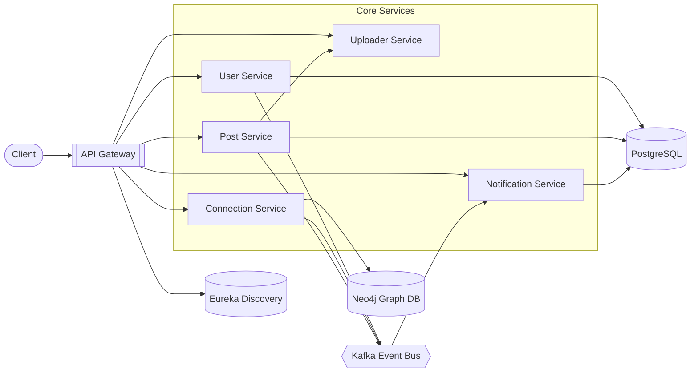

# LinkedIn Distributed System

## Event-Driven Microservices Backend using Spring Boot, Kafka, Neo4j & PostgreSQL

A production-grade distributed backend system inspired by LinkedIn, built using **Spring Boot microservices architecture** to simulate real-world social networking workflows such as:

- User Authentication & Authorization
- Connection Graph Management
- Feed Generation
- Likes & Comments
- Asynchronous Notifications
- Media Upload Handling

This project demonstrates **distributed systems design**, **event-driven communication**, and **polyglot persistence**.

---

# System Architecture



---

# Microservices

## User Service
Handles:

- User Signup
- User Login
- JWT Token Generation
- Password Encryption using BCrypt
- User Creation Event Publishing

---

## Connection Service
Implements LinkedIn-style social graph operations.

Features:

- Send Connection Request
- Accept / Reject Requests
- Remove Connections
- Mutual Connections
- Second Degree Connections
- Shortest Path Discovery

Database:

**Neo4j Graph Database**

---

## Post Service
Responsible for content lifecycle.

Features:

- Create Posts
- Upload Media
- Generate Feed
- Like / Unlike
- Add Comments
- Retrieve Comments

---

## Notification Service
Consumes Kafka events asynchronously.

Triggers notifications for:

- Connection Requests
- Connection Acceptance
- New Posts
- Likes
- Comments

---

## Uploader Service
Handles media upload and storage.

Integrated with:

**Cloudinary**

---

## API Gateway
Single entry point for all services.

Responsibilities:

- Routing
- JWT Validation
- Authentication Enforcement
- Context Propagation

---

## Discovery Server
Service registration and discovery using:

**Netflix Eureka**

---

# Event Driven Communication

Kafka Topics:

- `user_created_topic`
- `connection_request_sent_topic`
- `connection_accepted_topic`
- `post_created_topic`
- `post_liked_topic`
- `post_commented_topic`

---

# Tech Stack

## Backend
- Java 21
- Spring Boot
- Spring Security
- Spring Cloud
- OpenFeign
- Apache Kafka

## Databases
- PostgreSQL
- Neo4j

## Infrastructure
- Eureka Discovery Server
- API Gateway

## Media
- Cloudinary

---

# Key Engineering Concepts

- Distributed Systems
- Event-Driven Architecture
- Graph Database Modeling
- Polyglot Persistence
- Service Discovery
- API Gateway Pattern
- Inter-Service Communication
- Global Exception Handling

---

# Security Flow

```text
Client Request
   ↓
API Gateway
   ↓
JWT Validation
   ↓
Request Forwarding
   ↓
User Context Propagation
   ↓
Target Microservice
```

---

# Local Setup

Start services in order:

1. Discovery Server
2. Kafka
3. User Service
4. Connection Service
5. Post Service
6. Notification Service
7. Uploader Service
8. API Gateway

---

# Future Enhancements

- Redis Caching
- WebSocket Notifications
- Docker Deployment
- Kubernetes Orchestration
- CI/CD Pipeline

---

# Author

**Ashutosh Sharma**

Java Backend Engineer  
Spring Boot • Kafka • Microservices • Distributed Systems
